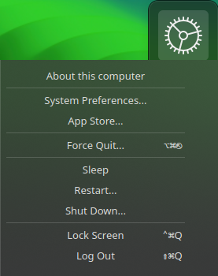

It's basically plasmoid which adds menu with some controllers, which allows you to turn computer off, log out and so on:

### Motivation

I used [original plasmoid](https://www.opencode.net/arshbangar/corner-menu) for some months and I really liked it. With update to KDE Plasma 6 it got broken. So I tried to reproduce it's functionality by myself.